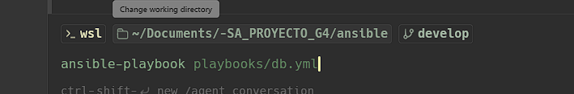
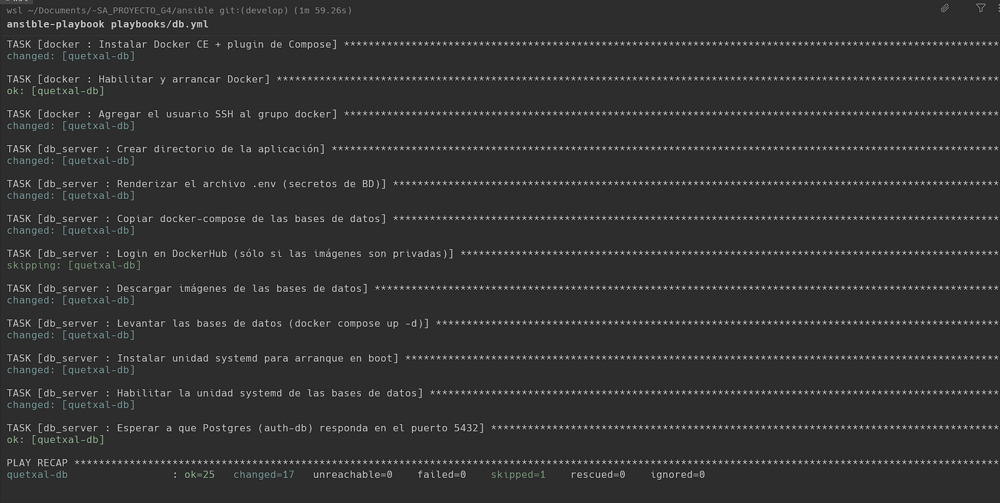
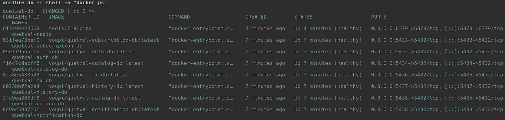

# Manual de Ansible — Quetxal TV (Fase 3)

> **Tarea 8 — Gestión de Configuración Automatizada.** Aprovisionamiento *agentless* (sólo SSH) de las
> VMs creadas por Terraform: instalación de Docker y dependencias, montaje del disco persistente y
> despliegue de las bases de datos y de los componentes de desarrollo.

## 1. ¿Qué es y cómo funciona?

**Ansible** automatiza la configuración de servidores conectándose por **SSH** y ejecutando módulos de
Python de forma temporal en el host remoto: **no requiere instalar ningún agente** (modelo *agentless*).

- **Inventario:** lista de hosts agrupados (`db`, `dev_gateway`, `dev_services`). Lo genera Terraform
  con las IPs reales.
- **Playbook:** archivo YAML que orquesta qué **roles** se aplican a qué grupos de hosts.
- **Rol:** conjunto reutilizable de *tasks* (p. ej. instalar Docker).
- **Idempotencia:** aplicar el playbook varias veces converge al mismo estado (no repite cambios ya hechos).

## 2. Estructura

```
ansible/
├── ansible.cfg                       # SSH, become, inventario por defecto
├── inventory/
│   ├── hosts.gen.ini                 # GENERADO por Terraform (IPs reales) — gitignored
│   └── group_vars/
│       ├── all/vars.yml              # variables comunes (no secretas)
│       ├── all/secrets.yml           # contraseñas (gitignored, ansible-vault)
│       ├── dev_gateway.yml / dev_services.yml
├── roles/
│   ├── common/                       # apt, paquetes base, timezone, logrotate
│   ├── docker/                       # disco persistente + Docker CE + Compose plugin
│   ├── db_server/                    # 7 Postgres + Redis (docker-compose.db.yml) + systemd
│   └── dev_vm/                       # compose gateway/services + .env.cloud + systemd
└── playbooks/
    ├── site.yml · db.yml · dev.yml
```

## 3. Requisitos previos

```bash
pip install ansible                                   # o sudo apt install ansible
cp inventory/group_vars/all/secrets.example.yml inventory/group_vars/all/secrets.yml
$EDITOR inventory/group_vars/all/secrets.yml          # contraseñas reales
# (recomendado) ansible-vault encrypt inventory/group_vars/all/secrets.yml
```

## 4. Ejecución paso a paso

### 4.1 Verificar conectividad (agentless)

```bash
ansible db -m ping       # respuesta: "ping": "pong"
```

### 4.2 Aprovisionar la VM de Base de Datos

```bash
ansible-playbook playbooks/db.yml
```



El playbook instala Docker, monta el disco persistente y levanta las bases de datos. Al final, el
`PLAY RECAP` muestra el resultado de todas las tareas:



### 4.3 Verificar el resultado

```bash
ansible db -m shell -a "docker ps"
```



> Las **7 bases Postgres + Redis** quedan `(healthy)`, cada una en su puerto (5432-5438 / 6379),
> corriendo en la VM externa — fuera de los Pods de Kubernetes (Persistencia Aislada, tarea 9).

### 4.4 Aprovisionar las VMs de desarrollo

```bash
ansible-playbook playbooks/dev.yml
```

## 5. Qué hace cada rol

- **common:** actualiza apt, instala utilidades base, fija la zona horaria (`America/Guatemala`) y
  configura `logrotate` para los logs de Docker.
- **docker:** en la VM de BD formatea y monta el disco persistente `quetxal-db-data` en `/var/lib/docker`
  (los volúmenes de las BD sobreviven al ciclo de los contenedores), luego instala Docker CE + Compose.
- **db_server:** renderiza `.env` (secretos), copia `docker-compose.db.yml`, hace `docker compose up -d`
  con las 7 Postgres + Redis e instala una unidad `systemd` para arranque automático.
- **dev_vm:** copia el compose del componente (gateway/services), renderiza `.env.cloud` apuntando a la
  IP interna de la VM de BD (`10.10.0.10`) y arranca el servicio vía `systemd`.

## 6. Decisiones de diseño

- **Agentless por SSH:** sin agentes que mantener; Ansible reemplaza los `startup-scripts` en bash de la
  Fase 2 por playbooks declarativos e idempotentes.
- **Disco persistente montado en `/var/lib/docker`:** garantiza que los volúmenes de las BD persistan.
- **Secretos fuera del repo:** las contraseñas viven en `group_vars/all/secrets.yml` (gitignored,
  cifrable con `ansible-vault`); nunca se suben (requisito de la tarea 10).
- **VM de servicios privada:** se alcanza vía la VM gateway como bastión (ProxyCommand SSH).
