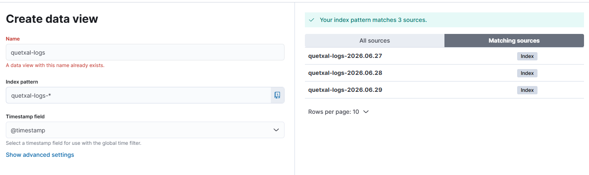
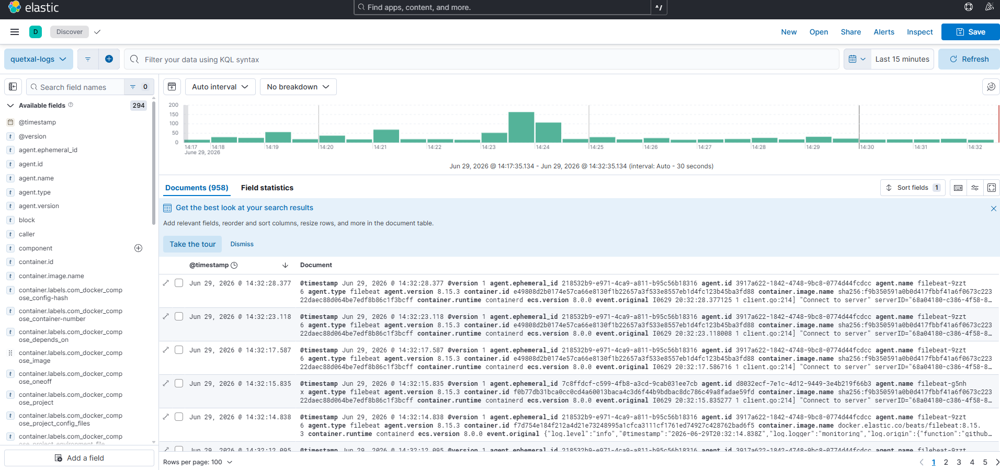
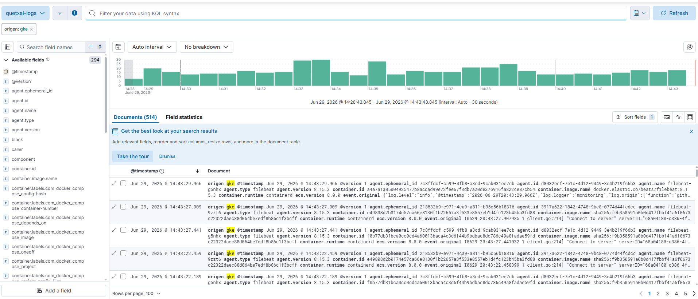
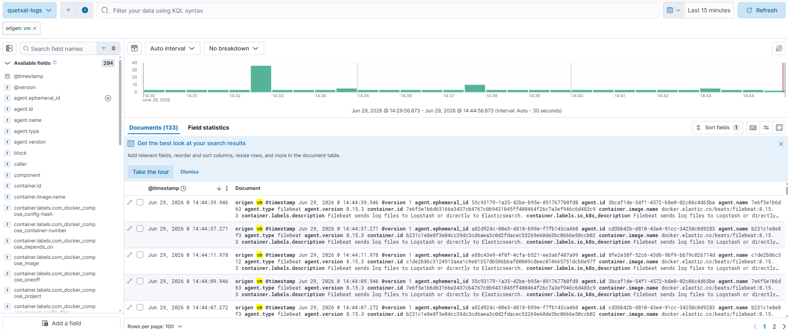
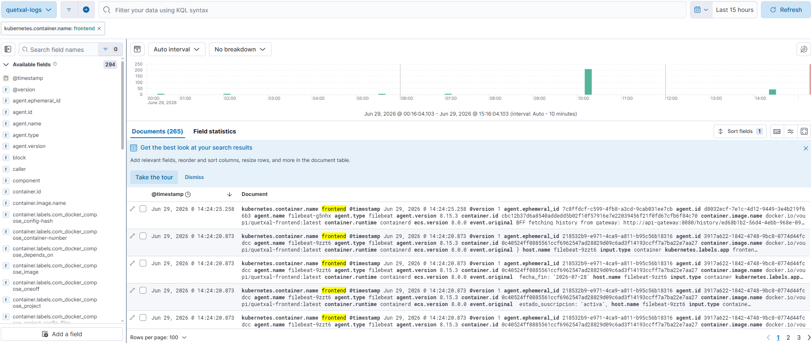
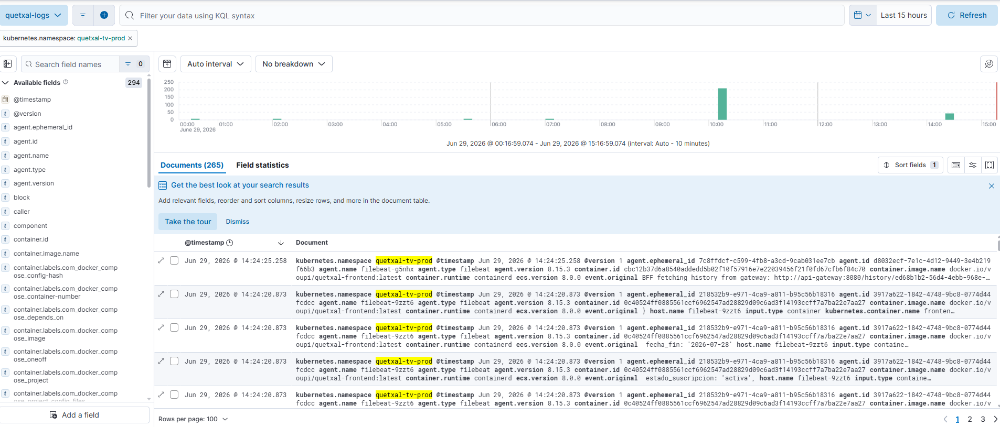

# Manual del Stack ELK — Quetxal TV (Fase 3)

> **Stack de Observabilidad de Logs (ELK).** Recolección y centralización de los logs
> de auditoría de **todos los contenedores (cluster GKE) y servidores externos (VMs)**
> mediante Elasticsearch, Logstash y Kibana, desplegado en la nube.

## 1. ¿Qué es y cómo funciona?

**ELK** es la pila de observabilidad de logs de Elastic, compuesta por tres piezas:

- **Elasticsearch** — motor de búsqueda y **almacenamiento** indexado. Guarda cada línea de
  log como un documento JSON dentro de índices diarios y permite consultarlos en milisegundos.
- **Logstash** — capa de **filtrado y transformación**. Recibe los logs de los agentes,
  los enriquece/parsea (marca el origen, decodifica JSON) y los escribe en Elasticsearch.
- **Kibana** — capa de **visualización**. Se conecta a Elasticsearch y permite explorar,
  filtrar y graficar los logs (vista *Discover*, dashboards, etc.).

El envío de logs se hace por **inyección de agentes** (*Filebeat*), que es uno de los dos
mecanismos que admite el enunciado (agentes o redirección de streams de salida). Filebeat
lee la salida estándar de los contenedores y la reenvía a Logstash.

En Quetxal TV el stack centraliza:

- **Logs de todos los contenedores del cluster GKE** (microservicios, frontend, gateway,
  infraestructura) vía un DaemonSet de Filebeat.
- **Logs de los servidores externos** (VM de base de datos y VMs de desarrollo) vía Filebeat
  en cada VM, incluyendo los contenedores de PostgreSQL/Redis.

## 2. Arquitectura de recolección

```
        Filebeat (DaemonSet GKE)          Filebeat (VMs: db, gateway, services)
        logs de los Pods                  logs de los contenedores Docker
                │                                     │
                └──────────────┬──────────────────────┘
                               ▼  Beats :5044
                          Logstash            (filtra: marca origen gke/vm, parsea JSON)
                               ▼
                        Elasticsearch         (índices quetxal-logs-YYYY.MM.dd)
                               ▼
                           Kibana             (Discover / dashboards — túnel SSH)
```

Todo el stack ELK corre en una **VM dedicada y privada** (`quetxal-elk-vm`, `10.10.0.20`),
porque Elasticsearch es muy exigente en memoria para los nodos de GKE. Esto además encaja
con el patrón de "servidores externos" del proyecto.

| Componente | Dónde | Puerto |
|---|---|---|
| Elasticsearch | VM ELK | 9200 |
| Logstash (entrada Beats) | VM ELK | 5044 |
| Kibana | VM ELK | 5601 (solo por túnel SSH) |
| Filebeat (cluster) | DaemonSet en cada nodo GKE | — |
| Filebeat (VMs) | contenedor en db / gateway / services | — |

## 3. Infraestructura y archivos

| Recurso | Archivo |
|---|---|
| VM de ELK + disco de índices (Terraform) | `terraform/elk_vm.tf` |
| Stack ELK (Docker Compose) | `docker-compose.elk.yml` |
| Pipeline de Logstash | `elk/logstash/pipeline/logstash.conf` |
| Provisión de la VM (Ansible) | `ansible/roles/elk_server/`, `ansible/playbooks/elk.yml` |
| Filebeat en las VMs (Ansible) | `ansible/roles/filebeat/` |
| Filebeat en GKE (DaemonSet) | `k8s/logging/filebeat.yaml` |

> El firewall interno de la VPC (`allow_internal`) ya permite que los Beats del cluster y de
> las VMs alcancen Logstash en `10.10.0.20:5044`. No requiere regla adicional.

## 4. Despliegue paso a paso

### 4.1 Crear la VM de ELK (Terraform)

La VM, su disco para índices y la IP interna estática se declaran en `terraform/elk_vm.tf`
y se crean con el resto de la infraestructura:

```bash
cd terraform
terraform apply
```

Esto crea `quetxal-elk-vm` (privada, `10.10.0.20`) y regenera el inventario de Ansible
con el grupo `[elk]`.

### 4.2 Provisionar el stack y los agentes (Ansible)

```bash
cd ansible
ansible-playbook -i inventory/hosts.gen.ini playbooks/elk.yml
```

El playbook:

1. Monta el disco persistente y instala Docker en la VM de ELK.
2. Sube `vm.max_map_count` (requisito de Elasticsearch) y levanta `docker-compose.elk.yml`
   (Elasticsearch + Logstash + Kibana) vía systemd.
3. Despliega **Filebeat** en las VMs de BD y desarrollo, apuntando a Logstash `10.10.0.20:5044`.

### 4.3 Desplegar el agente del cluster (Filebeat DaemonSet en GKE)

```bash
kubectl apply -f k8s/logging/
kubectl -n logging get pods -o wide
```

Crea el namespace `logging`, el RBAC para leer metadata de Kubernetes y el DaemonSet de
Filebeat (un Pod por nodo) que envía los logs de todos los Pods a Logstash. Este paso también
está integrado en el pipeline de CI/CD (`.github/workflows/deploy-k8s.yml`).

## 5. Verificación

Desde la VM de ELK (o por túnel), confirmar que llegan logs a Elasticsearch:

```bash
# Índices diarios con su conteo de documentos
curl -s 'http://localhost:9200/_cat/indices/quetxal-logs-*?v'

# Conteo por origen (debe aparecer gke y vm)
curl -s 'http://localhost:9200/quetxal-logs-*/_search' -H 'Content-Type: application/json' \
  -d '{"size":0,"aggs":{"por_origen":{"terms":{"field":"origen.keyword"}}}}'
```

Resultado esperado: índices `quetxal-logs-YYYY.MM.dd` con miles de documentos y ambas fuentes
presentes (`origen=gke` y `origen=vm`).

## 6. Acceso a Kibana y evidencia

Kibana es privado (no se expone a internet). Se accede por **túnel SSH** a través del gateway:

```bash
ssh -i ~/.ssh/id_rsa -N -L 5601:localhost:5601 \
  -o StrictHostKeyChecking=no \
  -o ProxyCommand="ssh -W %h:%p -i ~/.ssh/id_rsa -o StrictHostKeyChecking=no ubuntu@<IP_GATEWAY>" \
  ubuntu@10.10.0.20
```

Luego abrir `http://localhost:5601`.

### 6.1 Crear el Data View (una sola vez)

En **Discover**, crear un *data view*:

- **Name:** `quetxal-logs`
- **Index pattern:** `quetxal-logs-*`
- **Timestamp field:** `@timestamp`



### 6.2 Logs indexados (Discover)

Con el rango de tiempo en *Last 24 hours*, Discover muestra el flujo de logs indexados en vivo:



### 6.3 Logs de todos los contenedores del cluster

Filtro KQL: `origen: "gke"`



### 6.4 Logs de los servidores externos (VMs)

Filtro KQL: `origen: "vm"`



### 6.5 Logs transaccionales de un servicio

Filtro KQL: `kubernetes.container.name: "frontend"` — muestra la actividad transaccional
(llamadas BFF al gateway, estado de suscripción, historial, etc.).



### 6.6 Logs transaccionales por namespace de la aplicación

Filtro KQL: `kubernetes.namespace: "quetxal-tv-prod"`



## 7. Decisiones de diseño

- **ELK en VM dedicada (no en GKE):** Elasticsearch necesita ~2 GB de heap; ponerlo fuera del
  cluster evita degradar la app y respeta el aislamiento de "servidores externos".
- **VM privada + Kibana por túnel SSH:** reduce la superficie pública; el Ingress sigue siendo
  el único punto de entrada web de la aplicación.
- **Filebeat como agente (DaemonSet en GKE + contenedor en VMs):** "inyección de agentes" —
  un solo Pod por nodo y un contenedor por VM recolectan todo sin instrumentar cada microservicio.
- **Campo `origen` (gke/vm) en Logstash:** permite distinguir y filtrar en Kibana los logs del
  cluster vs los de los servidores externos para la evidencia.
- **Índices diarios `quetxal-logs-YYYY.MM.dd`:** facilitan la retención y la navegación temporal.
- **Sin seguridad X-Pack:** entorno académico con acceso solo interno; en producción se habilitaría
  autenticación y TLS.
