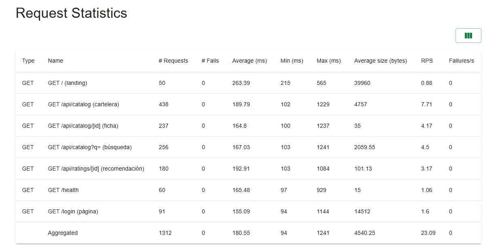
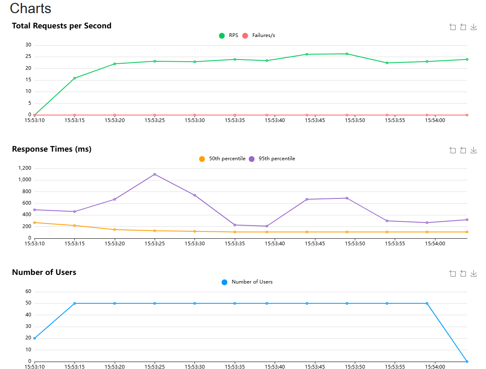

# Manual de Pruebas de Carga — Locust (Quetxal TV, Fase 3)

> **Pruebas de carga ligera (Locust) en la nube.** Simulación de usuarios concurrentes
> inyectando tráfico en las rutas críticas del API Gateway, con reporte HTML de resultados.

## 1. ¿Qué es y cómo funciona?

**Locust** es una herramienta de pruebas de carga distribuida basada en **código Python**.
Cada "usuario virtual" es una clase que ejecuta tareas (peticiones HTTP) con tiempos de espera
aleatorios entre ellas, simulando comportamiento real. Locust mide RPS, tiempos de respuesta
(percentiles), fallos y los grafica en tiempo real, y puede exportar un **reporte HTML**.

## 2. Escenarios simulados (`locustfile.py`)

Dos perfiles de usuario con tareas ponderadas (mayor peso = más frecuente):

| Perfil | Tarea | Peso | Ruta crítica |
|---|---|---|---|
| **VisitanteAnonimo** | Explorar cartelera | 10 | `GET /api/catalog` |
| | Buscar contenido | 6 | `GET /api/catalog?q=` |
| | Ver ficha técnica | 5 | `GET /api/catalog/[id]` |
| | Ver recomendación | 4 | `GET /api/ratings/[id]` |
| | Página de login | 2 | `GET /login` |
| | Healthcheck | 1 | `GET /health` |
| **UsuarioAutenticado** | Login + navegación | — | `POST /api/auth/login` + catálogo |

Al arrancar, Locust **siembra IDs reales** de contenido consultando `/api/catalog`, para que
las peticiones de ficha/recomendación usen identificadores válidos.

## 3. Cómo ejecutar

Dentro de un entorno virtual con las dependencias (`pip install -r requirements.txt`):

```bash
# ./run-load-test.sh <entorno> <usuarios> <spawn_rate> <run_time> [escenario]
./run-load-test.sh release 50 10 60s
```

- `entorno`: `release` (GKE, http://35.254.220.20) | `develop` (VMs) | URL completa.
- Genera en `reports/`: un **HTML** (`--html`) con los resultados y CSV crudos (gitignored).
- Modo *headless* (sin UI), ideal para CI/CD y para adjuntar el reporte como evidencia.

## 4. Resultados y evidencia

Ejecución contra **release (GKE)** con **50 usuarios concurrentes** durante 60 s:

| Métrica | Valor |
|---|---|
| Total de peticiones | **1312** |
| Fallos | **0 (0.00%)** |
| RPS agregado | **~23 req/s** |
| Latencia mediana | ~110 ms |
| Latencia p95 | ~550 ms |

Reporte HTML: `load-testing/reports/quetxal-release-20260629-155306.html`

### Request Statistics

Tabla de resultados por ruta (peticiones, fallos, tiempos y RPS):



### Charts

Gráficas de la prueba: RPS, tiempos de respuesta (p50/p95) y usuarios concurrentes en el tiempo:



## 5. Decisiones de diseño

- **Tareas ponderadas:** reflejan un uso realista (más navegación de catálogo que login).
- **Siembra de IDs reales:** evita 404 artificiales; la carga golpea datos existentes.
- **Headless + HTML/CSV:** reproducible en CI/CD y deja evidencia versionada.
- **Contra el release público (GKE):** mide la malla real detrás del Ingress (BFF → gateway →
  microservicios → BD externa), no un entorno local.
- **0 fallos bajo 50 usuarios:** la arquitectura (réplicas + Ingress + BD externa) soporta la
  ráfaga sin errores; las latencias p95 suben con la concurrencia pero sin caídas.
