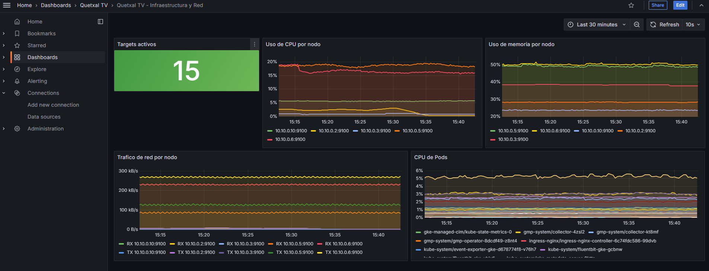
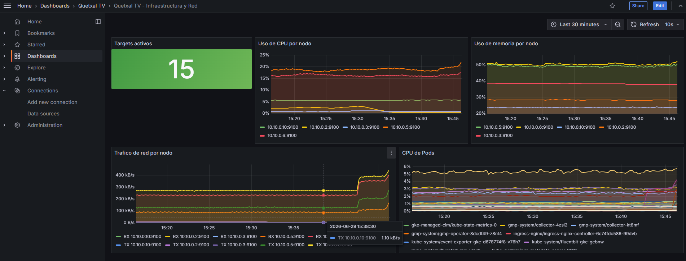

# Manual de Prometheus y Grafana — Quetxal TV (Fase 3)

> **Tarea 12 — Stack Prometheus & Grafana.** Recolección de métricas de hardware y red
> en tiempo real, con visualización centralizada en dashboards de Grafana.

## 1. ¿Qué es y cómo funciona?

**Prometheus** es una plataforma de monitoreo basada en series temporales. Su modelo principal es
el *scraping*: cada cierto intervalo consulta endpoints `/metrics`, almacena las muestras y permite
consultarlas con PromQL.

**Grafana** es la capa de visualización. Se conecta a Prometheus como *datasource* y transforma las
series temporales en paneles de CPU, memoria, red, disco, estado de servicios y contenedores.

En Quetxal TV el stack mide:

- **Hardware:** CPU, memoria y disco mediante `node_exporter`.
- **Red:** bytes recibidos/transmitidos por interfaz mediante `node_exporter`.
- **Contenedores y Pods:** CPU de contenedores mediante métricas de kubelet/cAdvisor.
- **Disponibilidad:** cantidad de targets activos y estado del scraping de Prometheus.

## 2. Arquitectura de monitoreo

```
                         Grafana
                            │ consulta PromQL
                            ▼
                       Prometheus
       ┌────────────────────┼────────────────────┐
       │                    │                    │
 node_exporter        kubelet/cAdvisor      Prometheus self
 CPU/Mem/Red          Pods/containers       salud del stack
       │                    │
 GCE VMs + nodos GKE       GKE
```

Se proveen dos rutas:

| Ruta | Uso | Archivos |
|---|---|---|
| Kubernetes / GKE | Ruta recomendada para calificación en nube | `k8s/monitoring/` |
| Docker Compose | Alternativa para VM gateway/services o evidencia rápida | `docker-compose.monitoring.yml`, `monitoring/` |

## 3. Despliegue recomendado en GKE

### 3.1 Conectarse al clúster

```bash
gcloud container clusters get-credentials quetxal-cluster \
  --zone us-central1-a \
  --project quetxal-tv-498705
```

### 3.2 Aplicar manifiestos

```bash
kubectl apply -k k8s/monitoring
```

Esto crea:

- Namespace `monitoring`.
- `node-exporter` como DaemonSet en cada nodo.
- Prometheus con RBAC para leer nodos, pods, endpoints y métricas de kubelet/cAdvisor.
- Grafana con datasource Prometheus y dashboard inicial provisionado.

### 3.3 Verificar Pods y targets

```bash
kubectl -n monitoring get pods
kubectl -n monitoring get svc
kubectl -n monitoring port-forward svc/prometheus 9090:9090
```

Abrir `http://localhost:9090/targets` y confirmar targets `UP`.



### 3.4 Abrir Grafana

```bash
kubectl -n monitoring port-forward svc/grafana 3001:3000
```

Entrar a `http://localhost:3001`.

Credenciales por defecto para demo: `admin/admin`. El manifiesto referencia `grafana-admin` como secreto **opcional**, por lo que no se versiona una contraseña real en el repositorio. En producción se recomienda crear el secreto directamente en el cluster:

```bash
kubectl -n monitoring create secret generic grafana-admin \
  --from-literal=password='CAMBIAR_PASSWORD'
kubectl -n monitoring rollout restart deployment/grafana
```

## 4. Despliegue alternativo en VM con Docker

En una VM de GCP con Docker instalado:

```bash
docker compose -f docker-compose.monitoring.yml up -d
docker ps
```

El stack levanta:

- Prometheus en `9090`.
- Grafana en `3001`.
- `node_exporter` en `9100`.
- `cAdvisor` en `8088`.
- `blackbox_exporter` en `9115`.

Para no abrir Grafana públicamente, usar túnel SSH:

```bash
ssh -L 3001:localhost:3001 usuario@IP_PUBLICA_VM
```

Luego abrir `http://localhost:3001`.

## 5. Dashboard y evidencia

El dashboard provisionado se llama:

```text
Quetxal TV / Quetxal TV - Infraestructura y Red
```

Paneles listos para captura:

| Panel | Evidencia |
|---|---|
| Targets activos | Prometheus está recolectando métricas vivas |
| Uso de CPU por nodo/host | Telemetría de hardware |
| Uso de memoria por nodo/host | Telemetría de hardware |
| Tráfico de red por nodo/host | Telemetría de red en tiempo real |
| CPU de Pods/contenedores | Uso de recursos de la aplicación |
| Uso de disco | Estado del almacenamiento |

Capturas obligatorias sugeridas:

1. `kubectl -n monitoring get pods` mostrando Prometheus, Grafana y node-exporter en ejecución.
2. Pantalla `Status > Targets` de Prometheus con targets `UP`.
3. Dashboard de Grafana con rango `Last 30 minutes`, refresh `10s` y líneas moviéndose.
4. Panel de red durante tráfico real contra el frontend/API Gateway.



## 6. Generar tráfico para demostrar telemetría viva

Mientras Grafana está abierto, ejecutar varias peticiones:

```bash
for i in {1..50}; do curl -s http://URL_PUBLICA/health >/dev/null; done
```

También se puede ejecutar Locust para elevar tráfico de API y evidenciar cambios en CPU/red.

## 7. Decisiones de diseño

- **Prometheus dentro de GKE:** permite descubrir nodos, Pods y endpoints sin exponer métricas a internet.
- **Grafana por port-forward:** reduce superficie pública; las capturas se toman desde una sesión segura.
- **node_exporter como DaemonSet:** cada nodo publica CPU, memoria, disco y red.
- **cAdvisor/kubelet:** las métricas de contenedores se obtienen desde kubelet, evitando instrumentar cada microservicio.
- **Dashboard provisionado:** el evaluador no depende de configuración manual; al levantar Grafana ya aparece el tablero.
