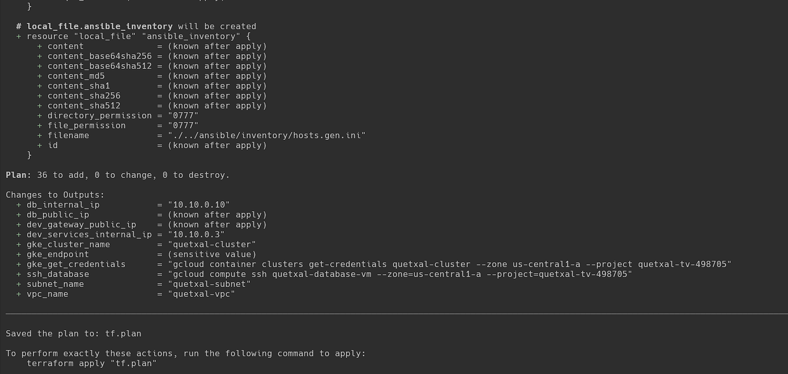
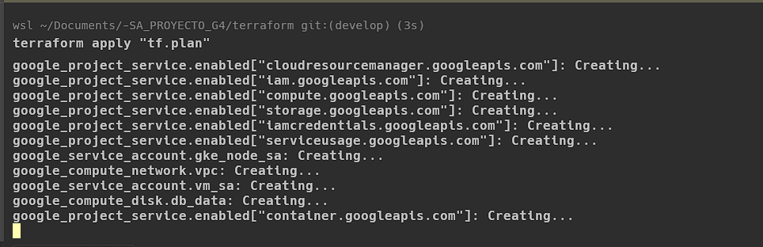
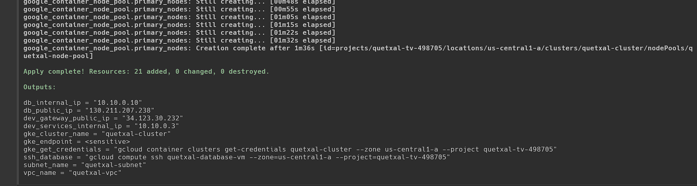
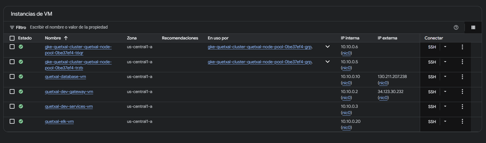
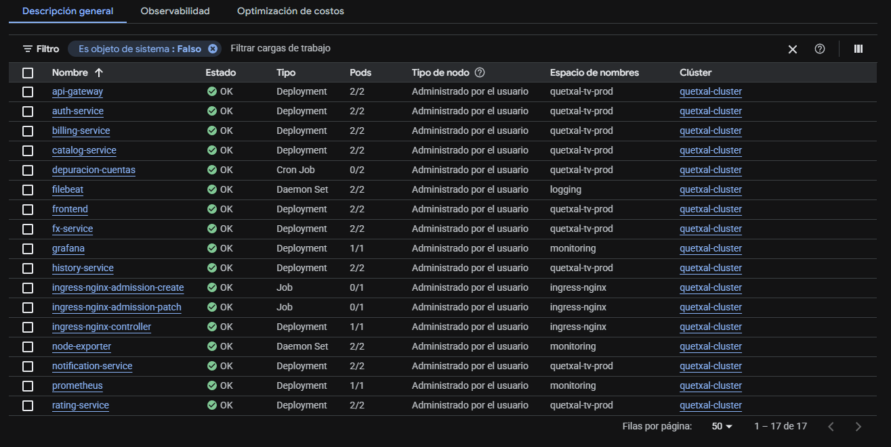
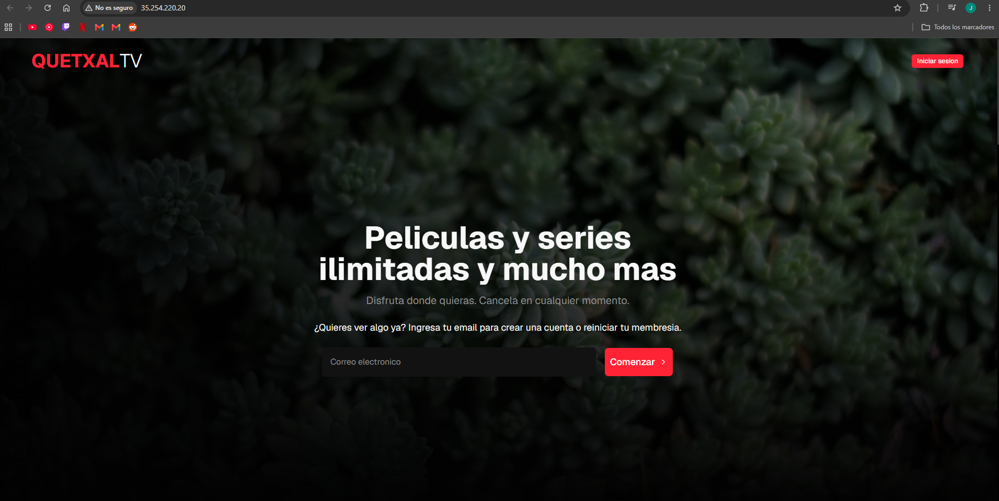

# Manual de Terraform — Quetxal TV (Fase 3)

> **Tarea 7 — Infraestructura como Código (IaC).** Aprovisionamiento declarativo de toda la
> infraestructura en Google Cloud Platform: VPC, subredes, firewalls, Cloud NAT, clúster de GKE,
> servidor de base de datos externo y VMs de desarrollo.

## 1. ¿Qué es y cómo funciona?

**Terraform** es una herramienta de *Infraestructura como Código* que permite **describir el estado
deseado** de la infraestructura en archivos declarativos (HCL) en lugar de crear los recursos a mano
en la consola. Terraform compara ese estado deseado con el estado real y aplica únicamente los cambios
necesarios para converger.

**Gestión del archivo de estado:** Terraform mantiene un archivo `terraform.tfstate` que mapea cada
recurso del código con su recurso real en la nube. Ese estado es la fuente de verdad: permite detectar
diferencias (`plan`), aplicar cambios incrementales (`apply`) y destruir exactamente lo creado
(`destroy`). *(El `tfstate` contiene datos sensibles y no se versiona — está en `.gitignore`.)*

**Flujo de trabajo:**

```
terraform init   → descarga proveedores e inicializa el backend
terraform plan   → previsualiza los cambios (no modifica nada)
terraform apply  → crea/modifica la infraestructura
terraform destroy→ elimina la infraestructura gestionada
```

## 2. Arquitectura provisionada

```
                         Internet
                            │
        ┌───────────────────┴────────────────────┐
   [LB Ingress GKE]                       [VM dev-gateway] (DMZ, IP pública)
    (única IP ext. de GKE)                       │
        │                                  [VM dev-services] (privada → NAT)
 ┌──────┴─────────────┐                           │
 │ GKE (VPC-native)    │      VPC quetxal-vpc · subred 10.10.0.0/20
 │ nodos PRIVADOS      │      secundarios: pods 10.16.0.0/14 · services 10.20.0.0/20
 │ + microservicios    │──────────► [VM quetxal-database-vm]  10.10.0.10
 │ + API Gateway       │   5432-5439   7 Postgres + Redis (Docker)
 │ + frontend + ingress│   6379        disco persistente quetxal-db-data (50 GB)
 └─────────────────────┘
```

| Recurso | Detalle |
|---|---|
| VPC + subred | `quetxal-vpc` · `10.10.0.0/20` + rangos secundarios (pods/services) para GKE VPC-native |
| Firewall | interno, SSH, HTTP/HTTPS al gateway, GKE→BD (5432-5439, 6379), health checks de LB |
| Cloud NAT | egreso a internet para nodos/VMs privados |
| GKE | `quetxal-cluster` zonal, nodos privados, Workload Identity, node pool propio |
| VM de BD | `quetxal-database-vm` (e2-medium) + disco persistente separado del SO |
| VMs de desarrollo | gateway (pública) + services (privada) — gated por `enable_dev_vms` |

## 3. Archivos del módulo

| Archivo | Contenido |
|---|---|
| `providers.tf` | Proveedor `google` (auth por ADC) y versiones |
| `apis.tf` | Habilitación automática de las APIs de GCP |
| `network.tf` | VPC, subred + rangos secundarios, firewall, router + NAT |
| `iam.tf` | Service accounts (VMs, nodos GKE) + Workload Identity de GCS |
| `gke.tf` | Clúster GKE + node pool |
| `db_vm.tf` | VM de BD + disco persistente + IP interna estática |
| `dev_vms.tf` | VMs gateway/services de desarrollo |
| `outputs.tf` | Salidas + generación del inventario de Ansible |
| `variables.tf` | Variables de entrada |

## 4. Requisitos previos

```bash
gcloud auth application-default login            # credenciales por ADC (sin llaves JSON)
gcloud config set project quetxal-tv-498705
ssh-keygen -t rsa -b 4096 -f ~/.ssh/id_rsa -N "" # llave SSH para Ansible
```

## 5. Configuración paso a paso

### 5.1 Inicializar y previsualizar

```bash
cd terraform
cp terraform.tfvars.example terraform.tfvars
terraform init
terraform plan -out tf.plan
```



> El plan resume los recursos a crear (`Plan: N to add`) y las salidas (IP de la BD, comando de
> credenciales de GKE, etc.) sin aplicar ningún cambio.

### 5.2 Aplicar

```bash
terraform apply tf.plan
```





> `Apply complete! Resources: 21 added` confirma la creación. Las salidas muestran la IP interna de la
> BD (`10.10.0.10`), la IP del gateway de desarrollo y el comando para conectar `kubectl` al clúster.

### 5.3 Recursos levantados (consola de GCP)

Evidencia en la nube de los recursos creados por el IaC.

**Compute Engine → Instancias de VM:** las 6 VMs RUNNING — `quetxal-database-vm`, `quetxal-dev-gateway-vm`, `quetxal-dev-services-vm`, `quetxal-elk-vm` y los 2 nodos del clúster GKE:



**Kubernetes Engine → Cargas de trabajo:** todo el sistema desplegado en `quetxal-cluster` — microservicios (`quetxal-tv-prod`), el CronJob de depuración, el DaemonSet de Filebeat (`logging`), Prometheus/Grafana/node-exporter (`monitoring`) e ingress-nginx, todos en estado OK:



**Sistema funcional:** el frontend de Quetxal TV servido en la IP pública del Ingress (`http://35.254.220.20`):



## 6. Destrucción (declarativa)

```bash
terraform destroy
```
> ⚠️ Solo después de la calificación (los sistemas GKE/Compute Engine no se dan de baja antes).

## 7. Decisiones de diseño

- **Nodos privados + Cloud NAT:** los nodos de GKE no tienen IP pública (la única IP externa del
  clúster es la del Ingress), lo que reduce superficie de ataque y consumo de cuota de IPs.
- **Rangos secundarios:** GKE VPC-native asigna IPs de Pods/Services desde rangos secundarios de la
  subred, requisito para que los Pods sean enrutables dentro de la VPC.
- **Disco persistente dedicado:** los datos de las BD viven en un disco separado del SO, garantizando
  persistencia e integridad fuera del ciclo de vida de los contenedores (requisito de Persistencia Aislada).
- **Autenticación por ADC:** sin llaves JSON estáticas; las VMs/nodos usan service accounts del entorno.
